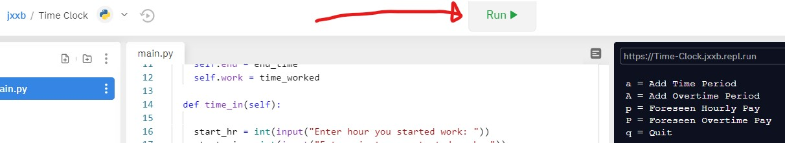
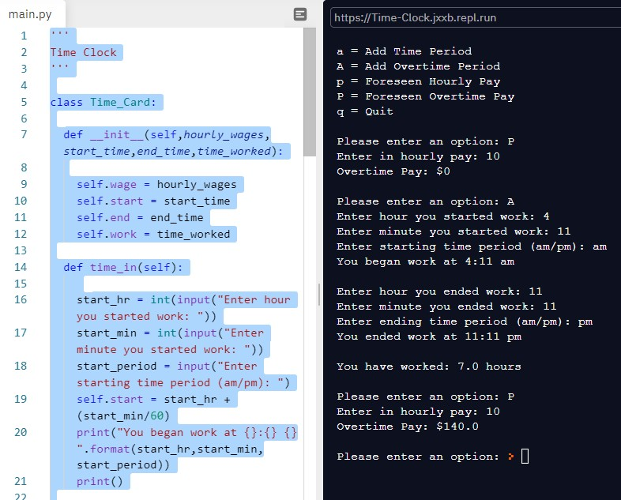

# Overview

This program allows users to input clock-in and clock-out times for hourly pay.  It demonstrates the use of objects, variables, and more.

# Environment

* REPL
* Python 3.8.2

# Execution

to run program: main.py
click run at the top of the repl page

# Screenshots

# Resources

https://data-flair.training/blogs/python-project-ideas
https://www.educba.com/do-while-loop-in-python/
https://docs.python.org/3/library/index.html
