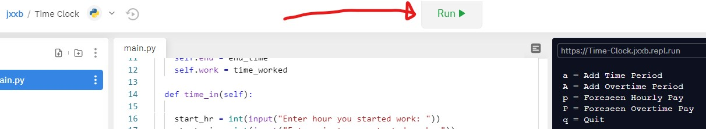

#Overview

This program allows users to input clock-in and clock-out times for hourly pay.  It demonstrates the use of 

#Environment

*REPL
*Python 3.8.2

#Execution

to run program: main.py

click run at the top of the repl page

#Screenshots

#Resources
